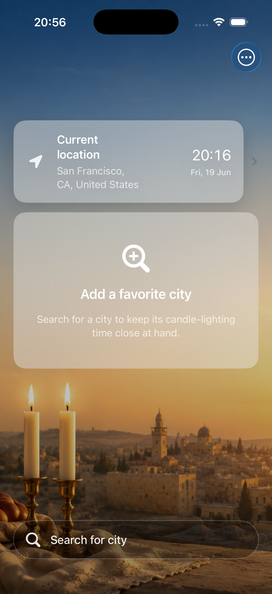
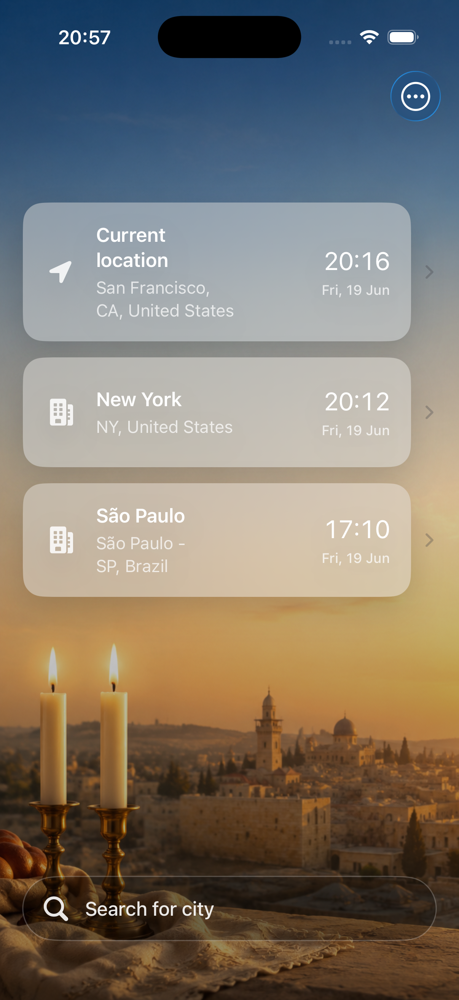
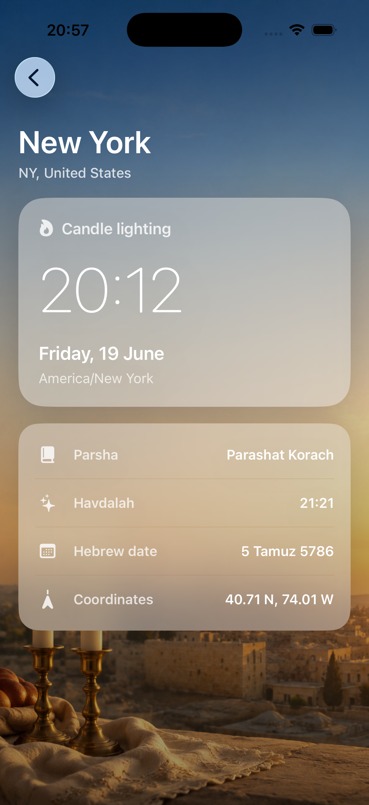
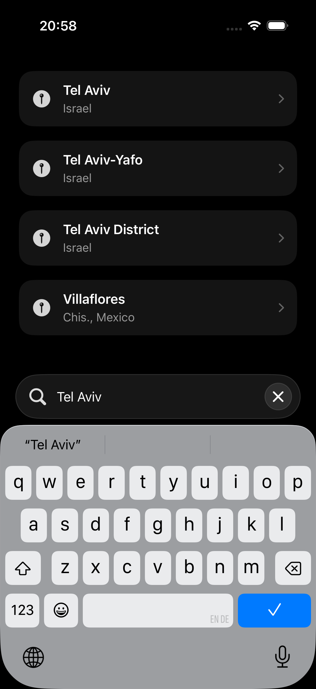

# Shabbat Helper

A small, focused iOS app that shows upcoming **Shabbat candle-lighting and Havdalah times** for your current location and any cities you save. Times, the weekly Torah portion (parsha), and the Hebrew date are fetched from the [Hebcal](https://www.hebcal.com/) API and presented in a clean, weather-style interface.

<p align="center">
  
  
  
</p>

## Features

- **Current location** – automatically detects where you are and shows this week's (or next week's, once Shabbat has passed) candle-lighting time.
- **Favorite cities** – search for and save any city in the world; reorder or delete them inline.
- **Shabbat details** – candle lighting, Havdalah, the weekly parsha, the Hebrew date, and coordinates for each location.
- **12h / 24h time** – toggle between AM/PM and 24-hour formats.
- **Fully localized** – English, Hebrew (with RTL support), Russian, French, and Amharic.
- **Pull to refresh** and graceful handling of offline / location-permission states.

| Home | Saved cities | Details | City search |
| :--: | :--: | :--: | :--: |
|  |  |  |  |

## Tech Stack

- **SwiftUI** with an MVVM architecture
- **CoreLocation** for current-location lookup and **MapKit** for city search/geocoding
- **Hebcal Shabbat API** for candle-lighting / Havdalah / parsha data
- **UserDefaults** for persisting saved locations and preferences
- **XCTest** for unit and UI tests

## Project Structure

App source lives under `shabbat-helper/` and is organized by responsibility:

```
shabbat-helper/
├── Models/        # Hebcal API response types, SavedLocation
├── Services/      # Hebcal API, location, geocoding, persistence, language mapping
├── ViewModels/    # Observable state and presentation logic
├── Views/         # SwiftUI screens, overlays, and formatting helpers
├── Assets.xcassets
└── *.lproj/       # Localizations: en, he, ru, fr, am
```

Tests live in `shabbat-helperTests/` (unit) and `shabbat-helperUITests/` (UI automation).

## Requirements

- Xcode 26 or newer
- iOS 26.5+ deployment target
- Swift 5

## Getting Started

Open the project in Xcode and run:

```sh
open shabbat-helper.xcodeproj
```

Then build and run with **⌘R** (choose a simulator or a device).

From the command line:

```sh
# Build
xcodebuild -project shabbat-helper.xcodeproj -scheme shabbat-helper build

# Test
xcodebuild -project shabbat-helper.xcodeproj -scheme shabbat-helper test
```

> The app requests **location access (When In Use)** to show candle-lighting times for where you are. You can also use the app entirely with manually-added favorite cities.

## License

This project is for personal use. Shabbat times are provided by [Hebcal](https://www.hebcal.com/); please review their terms of use.
